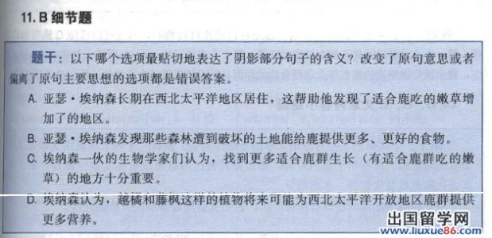
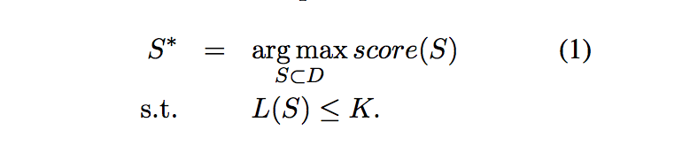
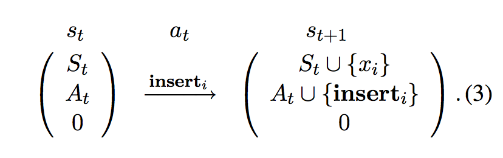
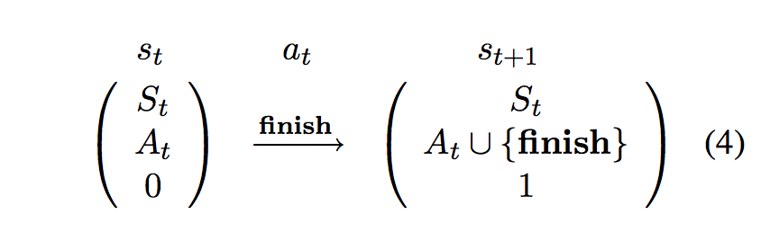
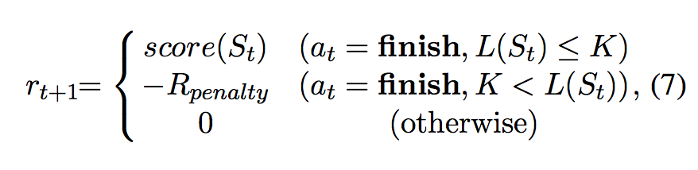
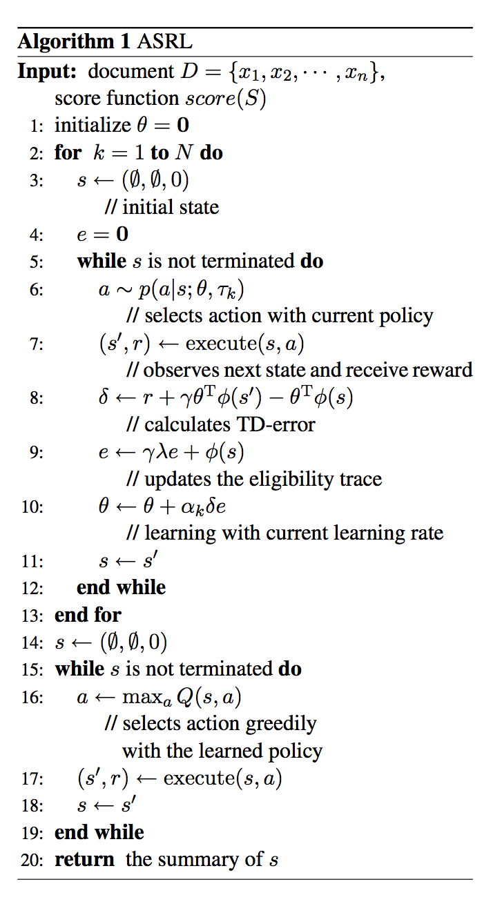

## Framework of Automatic Text Summarization Using Reinforcement Learning

### Introduction

Have u ever been comfused by a group of problems -- sentence simplification, just like below?

The sentence simplification is quite subtle and untractable. And in most tests (Gaokao and Toefl,etc.), it seems to be more art than science. However, NLPers dare to have a say on it. We model, we analyse and we solve it.

### Basic Model

The problem can be modelled as selecting a subset of words from the original document, thus the size of the subset does not exceed the maximun number of words limit while keeping the fluency of the summarization at the same time. The traditional way of doing such thing would be using ILP to enumerate all subsets or use greedy hueristics to solve this problem as follows.

### RL Solution

However, these methods lead to exponential computation or lack of flexibility. The methodology behind using RL is that, we can utilize the score function to construct an environment, thus enables the RL algorithm to learn the approximate optimal policy. The state transition is defined as follows.

And accordingly, the reward is defined as below.

The algorithm follows the standard of RL(basic TD).

