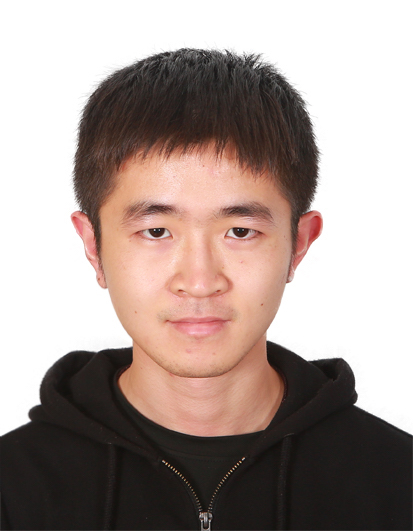

# Welcome to Qinghua Ding(Devon)'s Website

## About Me

I am a third-year student at the Computer Science and Technology Department, Tsinghua Univerisity. I like elegant mathematics and computational problems. My research interests is about theoretical computer science, specifically numerical and submodular optimization. I'm currently interested in **nonconvex optimization**. Moreover, you may find my cv [here](./my_cv.pdf).

## My Blogs

You may follow me at the [wordpress](https://devonsplace.wordpress.com/), where I'll discuss about my works.

## About My Research

I'm currently studying the **nonconvex optimization** problems. A very useful website can be attained [here (off the convex path)](http://www.offconvex.org/). And [here](./opt.pdf) is a helpful cheatshet on *convex optimization*.

Recently I've been widely reading about convex and non-convex optimization methods. And I have done a summary about classical convex or nonlinear optimization methods. You may find my summary [here](./summary.pdf).

And I've made another summary on stochastic optimization, composite optimization, and MOST IMPORTANTLY, recent advances in non-convex optimization methods in these areas. Please check the growing summary of the researches in this area [here](./new_theory.pdf).

## About My Life

My life is full of happiness and good luck. I have a great soul mate, Joris, who is also caring for my personal life. Our girl -- Teacher Cang -- a one-year-old hamster likes to chub woods. Also, our parents are quite warm-hearted and supportive of our relationship. 
